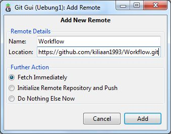
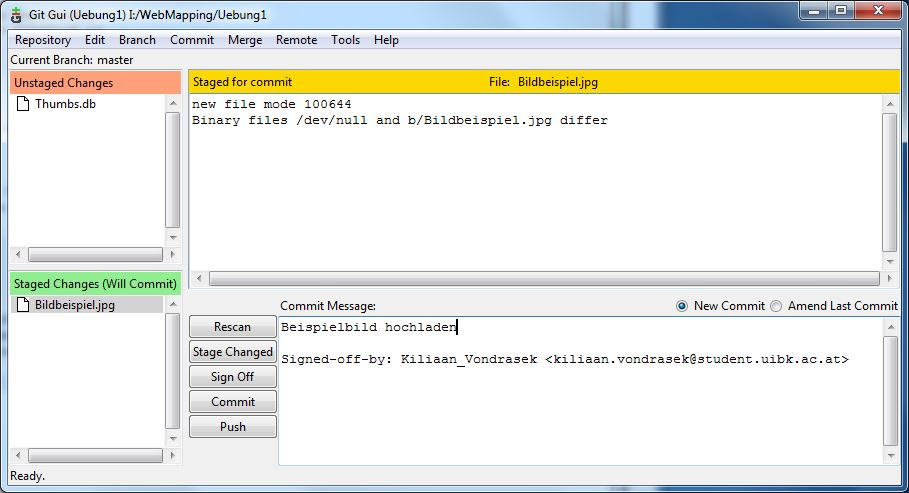

# Workflow

## Projekt anlegen

1. Git Gui starten und Projekt anlegen mit Create New Repository
1. Datei in diesen Ordner mit Notepad++ legen, Name = WORKFLOW.md
1. Auf Rescan drücken (siehe Screenshot 1)

Screenshot 1

Achtung bei den Bildern reinkopieren, manchmal .jpg und manchmal .JPG

## github.com Projekt anlegen

1. In github.com neues Projekt anlegen mit dem Namen Workflow
1. Den Link kopieren, in git hub Remote - Add und den Link reinkopieren, sowie den Projektnamen (siehe Screenshot 2)

Screenshot 2

## Bilder hochladen

1. Bild im Projektordner speichern (ohne .jpg, einfach nur z.B. Bildname)
1. mit Notepad++ folgendes Kommando geben: !(Titel des Bildes)[Bildname.JPG]
1. mit Git GUI Programm Rescan und dann alles Committen (siehe Screenshot 3)

Beispielbild

Screenshot 3