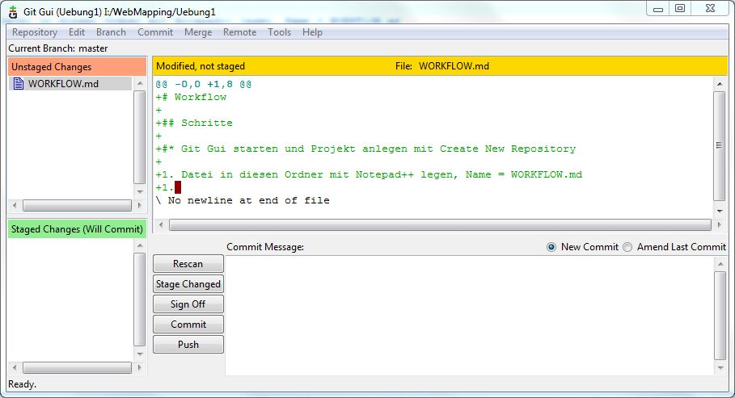

# Workflow

## Schritte

1. Git Gui starten und Projekt anlegen mit Create New Repository
1. Datei in diesen Ordner mit Notepad++ legen, Name = WORKFLOW.md
1. Auf Rescan drücken (siehe Screenshot 1)

